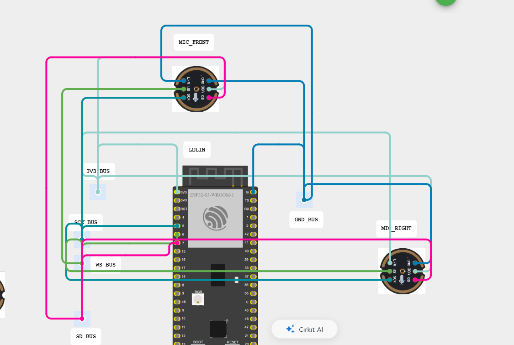
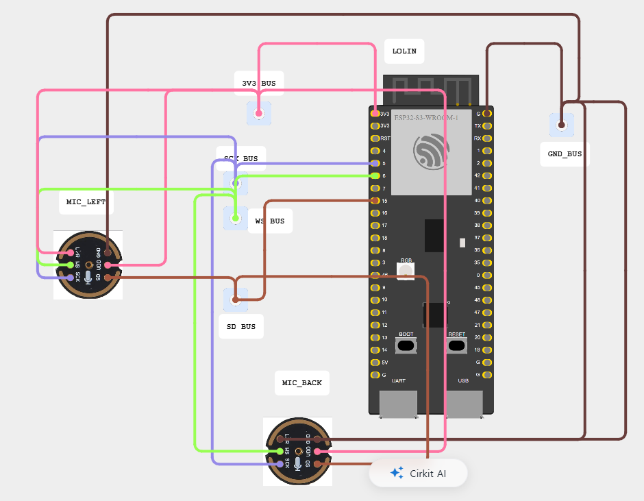
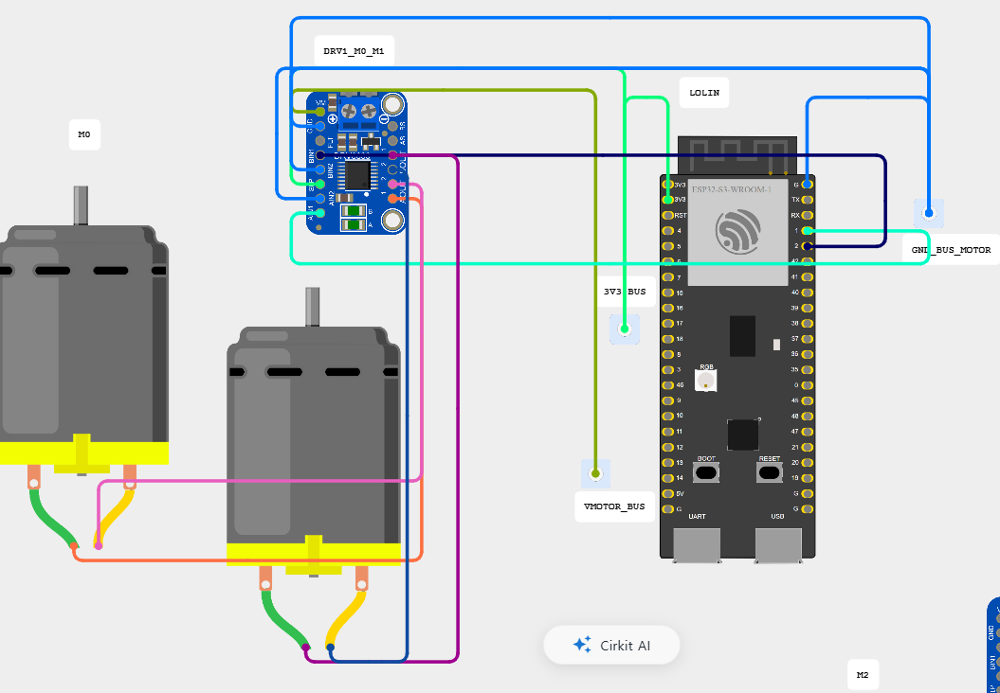
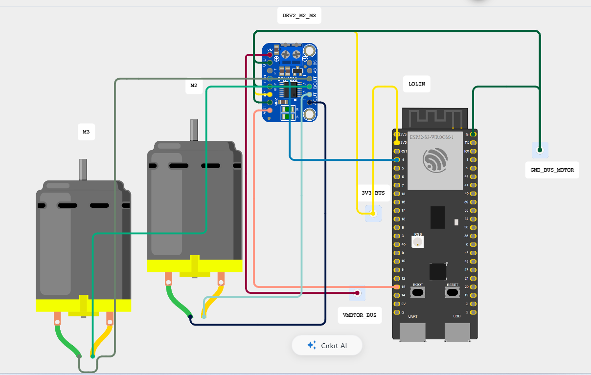
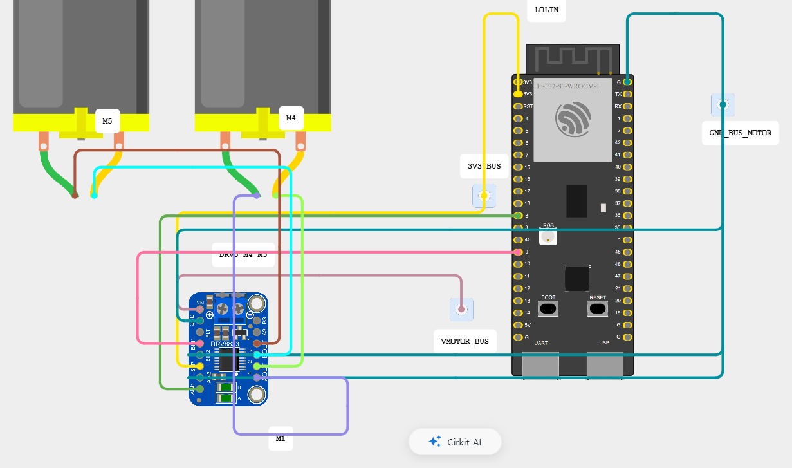
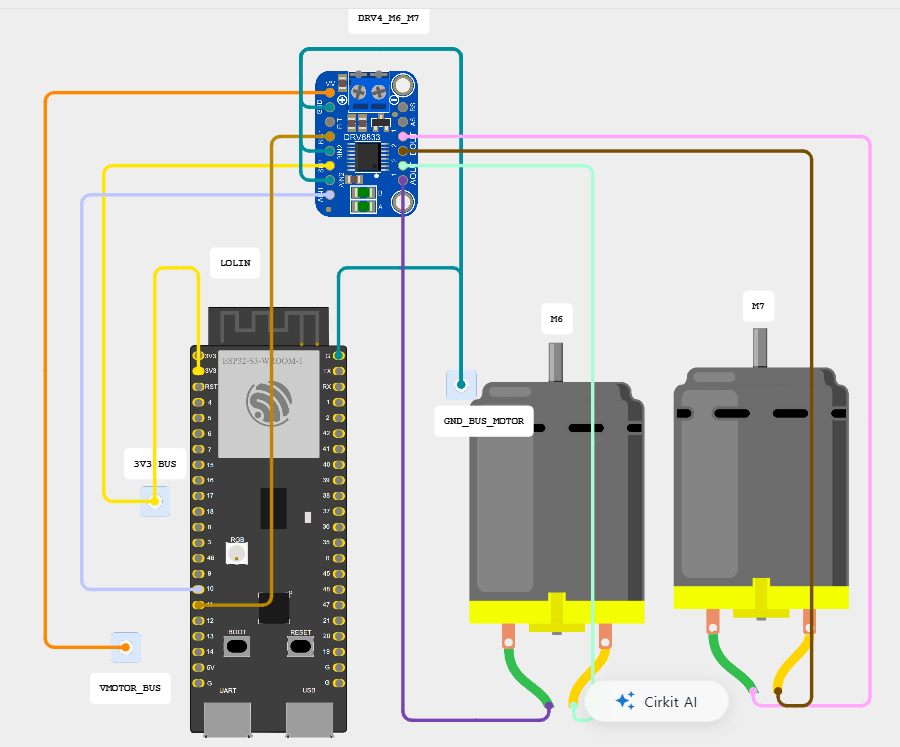
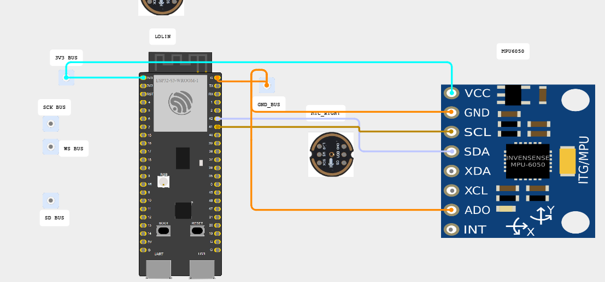
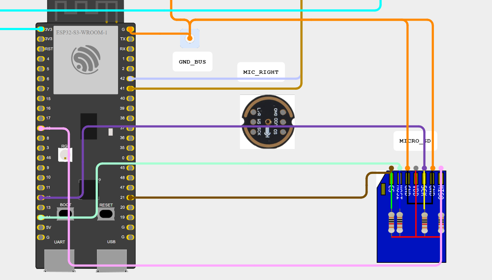

# MEIT 하드웨어 아키텍처

*방향성 위험음 촉각 알림 시스템*

> 이 문서는 현재 `meit-ee`의 하드웨어 구성과 배선 기준을 정리한 문서입니다. 아래 이미지는 팀에서 작성한 **wiring diagram**이며, 실제 하드웨어 검증 전에는 `PINMAP.md`, `config.h`와 함께 확인합니다.

---

## 1. 시스템 개요

MEIT는 주변 위험음을 수음하고 발생 방향을 추정한 뒤, 노트북 AI가 위험음 종류를 판별하면 해당 방향의 진동모터로 사용자에게 알리는 웨어러블 시스템입니다.

```text
INMP441 ×4
   │  dual-I2S, 48 kHz
   ▼
ESP32-S3 (LOLIN S3)
   │  TDoA 방향 추정 + 16 kHz PCM16
   ▼
BLE ── AUDIO / DIR ──► Laptop AI
    ◄────── CMD ──────┘
   │
   ▼
DRV8833 ×4
   │
   ▼
ERM Motors ×8
```

ESP32-S3는 4채널 오디오 수음, TDoA 방향 추정, BLE 통신, 모터 제어를 담당합니다. 위험음 분류와 진동 세기·패턴 결정은 BLE로 연결된 노트북에서 수행합니다.

---

## 2. 하드웨어 구성

| 분류 | 부품 | 수량 |
|---|---|---:|
| MCU | LOLIN S3 (ESP32-S3), 16 MB Flash / 8 MB OPI PSRAM | 1 |
| 마이크 | INMP441 I2S MEMS microphone | 4 |
| 모터 드라이버 | Adafruit DRV8833 dual H-bridge breakout | 4 |
| 햅틱 액추에이터 | 3 V ERM vibration motor | 8 |
| 배터리 | 1S LiPo, 3.7 V / 2000 mAh | 1 |
| 충전 모듈 | TP4056 USB-C module | 1 |
| 통신 | ESP32-S3 BLE | — |
| 옵션 | MPU-6050 / GY-521 IMU, microSD module | Optional |

---

## 3. 마이크 프론트엔드

INMP441 4개는 두 개의 stereo pair로 구성합니다. I2S0이 master로 BCLK/WS를 생성하고, I2S1은 같은 clock을 slave로 입력받습니다.

| 마이크 | 위치 | I2S | Slot | L/R | Data GPIO |
|---|---|---|---|---|---:|
| MIC0 | FRONT | I2S0 master | Left | GND | GPIO7 |
| MIC1 | RIGHT | I2S0 master | Right | 3V3 | GPIO7 |
| MIC2 | BACK | I2S1 slave | Left | GND | GPIO15 |
| MIC3 | LEFT | I2S1 slave | Right | 3V3 | GPIO15 |

```text
GPIO5  BCLK OUT ───► MIC0~3 SCK
        └──────────► GPIO16 BCLK IN

GPIO6  WS OUT   ───► MIC0~3 WS
        └──────────► GPIO17 WS IN

GPIO7  DIN ◄──────── FRONT + RIGHT SD
GPIO15 DIN ◄──────── BACK  + LEFT  SD
```

실제 clock jumper는 **GPIO5 → GPIO16**, **GPIO6 → GPIO17** 방향입니다.

- TDoA processing: **48 kHz**
- AI audio: **16 kHz mono PCM16**
- 구매한 INMP441 breakout의 0.1 µF decoupling은 실장된 것으로 확인했습니다.
- SD pull-down은 실제 breakout의 저항값 확인 후 필요 시 추가합니다.

### Pair A — FRONT + RIGHT



### Pair B — BACK + LEFT



---

## 4. 햅틱 출력

DRV8833 4개가 ERM 모터 8개를 제어합니다. 드라이버 하나당 모터 2개를 연결하고, 모터는 방향 index 0~7과 1:1로 대응합니다.

| Driver | Motors | 방향 | PWM GPIO |
|---|---|---|---|
| U1 | M0 / M1 | FRONT / FRONT_RIGHT | GPIO1 / GPIO2 |
| U2 | M2 / M3 | RIGHT / BACK_RIGHT | GPIO13 / GPIO4 |
| U3 | M4 / M5 | BACK / BACK_LEFT | GPIO8 / GPIO9 |
| U4 | M6 / M7 | LEFT / FRONT_LEFT | GPIO10 / GPIO11 |

각 채널은 단방향 PWM 방식으로 사용합니다.

```text
PWM GPIO ──► xIN1
GND      ──► xIN2
3V3      ──► SLP
VMOTOR   ──► VM
GND      ──► GND
xOUT1/2  ──► ERM motor
```

정상적인 방향 0~7은 해당 모터 하나를 구동합니다. `DIR_UNKNOWN`은 **FRONT → RIGHT → BACK → LEFT** 순서의 cardinal sweep을 사용하며, stale/invalid `event_id`는 motor OFF fail-safe로 처리합니다.

### U1 — M0 / M1



### U2 — M2 / M3



### U3 — M4 / M5



### U4 — M6 / M7



---

## 5. 전원 아키텍처

현재 전원부는 **hardware validation 단계**입니다.

```text
                 1S LiPo 3.7 V / 2000 mAh
                           │
                       TP4056
                           │
                     Main Switch
                 ┌─────────┴─────────┐
                 │                   │
            Logic branch        Motor branch
                 │                   │
        Power conversion TBD    VMOTOR candidate
                 │                   │
            LOLIN S3          DRV8833 ×4
                 │
                3V3
                 │
            INMP441 ×4
```

- Logic branch는 **5 V boost → LOLIN S3 +5V** 구성을 후보로 검토 중입니다.
- Motor branch는 **1S LiPo → DRV8833 VM** 직결을 candidate architecture로 검증 중입니다.
- Logic / microphone / motor는 공통 GND를 사용하되, motor high-current return이 microphone/logic return을 따라 흐르지 않도록 배선합니다.
- Adafruit DRV8833 breakout에는 local supply decoupling이 이미 포함되어 있습니다.
- TP4056 모듈의 protection / load-sharing과 배터리 PCM 여부는 실물 확인이 필요합니다.
- 외부 5 V와 USB power의 동시 인가는 현재 사용하지 않습니다.

> **Power distribution wiring diagram:** pending hardware validation.

---

## 6. GPIO / 핀맵

| 기능 | GPIO |
|---|---:|
| Motor 0 — FRONT | 1 |
| Motor 1 — FRONT_RIGHT | 2 |
| Motor 2 — RIGHT | 13 |
| Motor 3 — BACK_RIGHT | 4 |
| Motor 4 — BACK | 8 |
| Motor 5 — BACK_LEFT | 9 |
| Motor 6 — LEFT | 10 |
| Motor 7 — FRONT_LEFT | 11 |
| I2S0 BCLK / WS / DIN | 5 / 6 / 7 |
| I2S1 BCLK / WS / DIN | 16 / 17 / 15 |
| I2C SCL / SDA — optional IMU | 41 / 42 |
| microSD SCK / MOSI / MISO / CS | 12 / 14 / 18 / 21 |

---

## 7. 옵션 모듈

MPU-6050과 microSD는 현재 **MVP 필수 구성은 아니며**, 핀만 예약된 상태입니다. 핵심 기능인 microphone → TDoA → BLE → haptic output 검증 후 필요할 경우 통합합니다.

### MPU-6050 / GY-521



### microSD



---

## 8. 소프트웨어 / 하드웨어 인터페이스

```text
ESP32 → Laptop
  AUDIO : chunked 16 kHz PCM16
  DIR   : event_id, direction, confidence, dBFS

Laptop → ESP32
  CMD   : event_id, intensity, sound class, vibration pattern
```

ESP32는 `event_id`에 해당하는 방향을 로컬에 저장하고, 노트북 AI의 CMD가 돌아오면 같은 event의 방향을 조회해 모터를 구동합니다.

---

## 9. 현재 검증 상태

| 서브시스템 | 상태 |
|---|---|
| ESP-IDF 5.2.5 production build | Verified |
| LOLIN S3 16 MB Flash / 8 MB OPI PSRAM | Verified |
| GPIO mapping | Reviewed |
| TDoA synthetic 8-direction test | Passed |
| Motor host regression test | Passed |
| Event-direction fail-safe test | Passed |
| Dual-I2S software structure | Implemented |
| BLE baseline / protocol | Implemented |
| Physical dual-I2S synchronization | Pending |
| Real microphone capture / TDoA | Pending |
| Motor hardware validation | Pending |
| BLE hardware validation | Pending |
| Power architecture | Under validation |
| End-to-end integration | Pending |

---

## 10. Bring-up 순서

실제 하드웨어는 한 번에 전체를 연결하지 않고 다음 순서로 검증합니다.

**Power → ESP32 → Mic Pair A → Mic Pair B → Dual-I2S Sync → TDoA → 1 Motor → 8 Motors → BLE → AI → End-to-End**

각 단계가 독립적으로 정상 동작한 뒤 다음 단계로 진행합니다.
